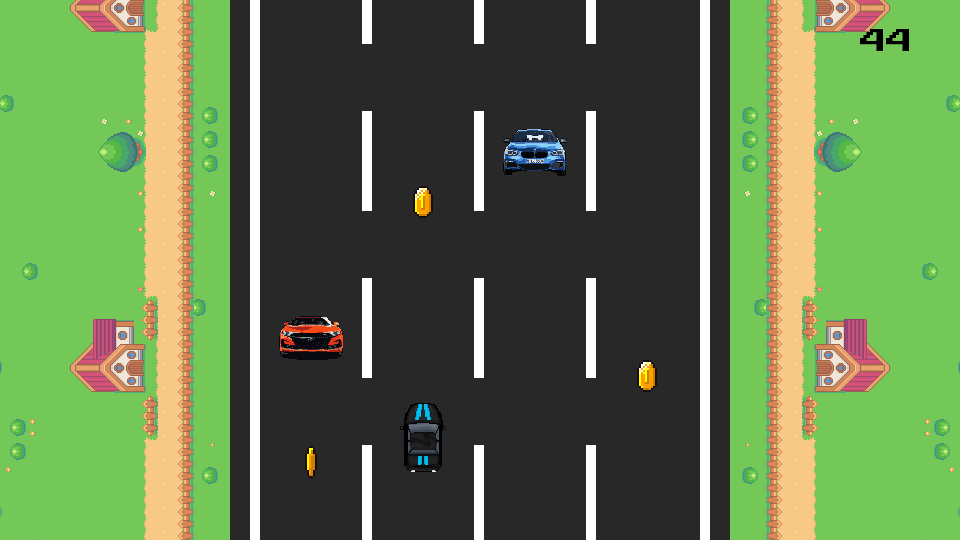
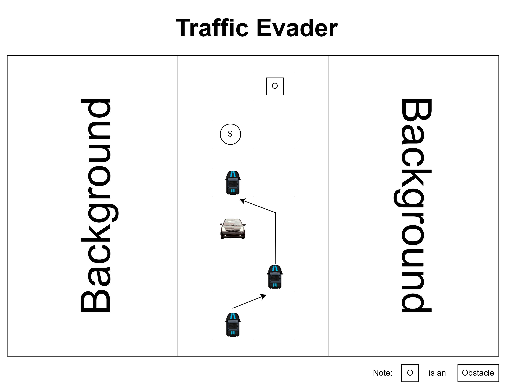
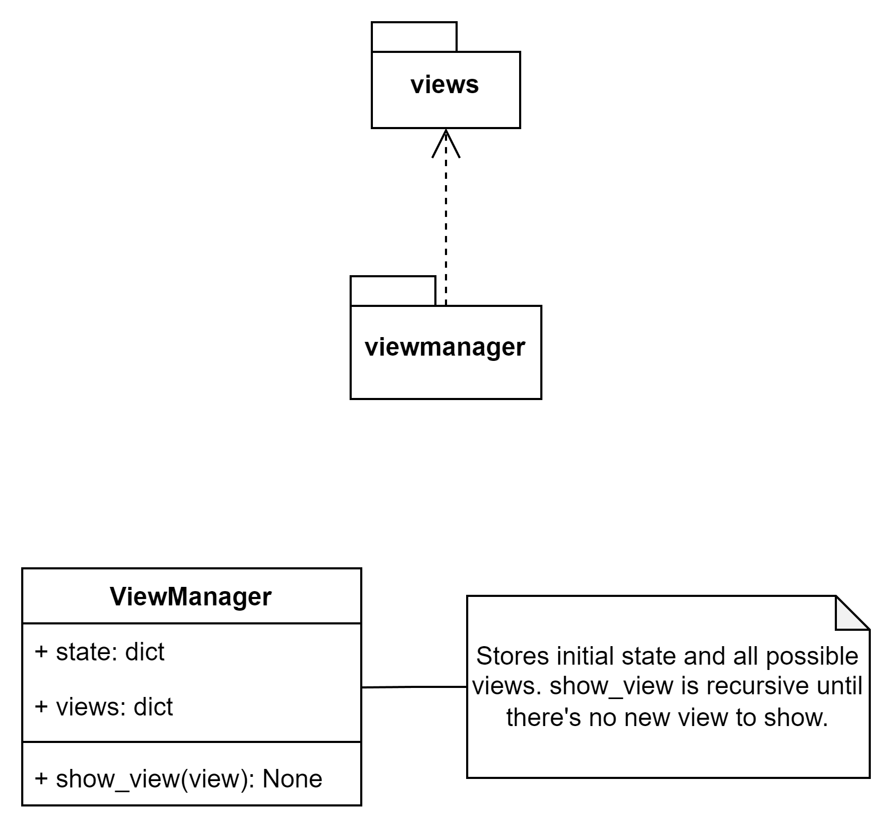
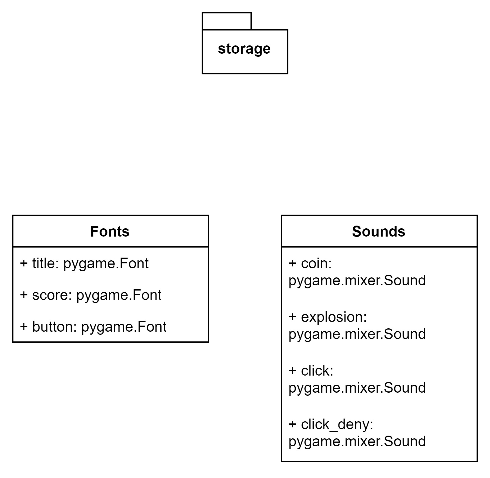
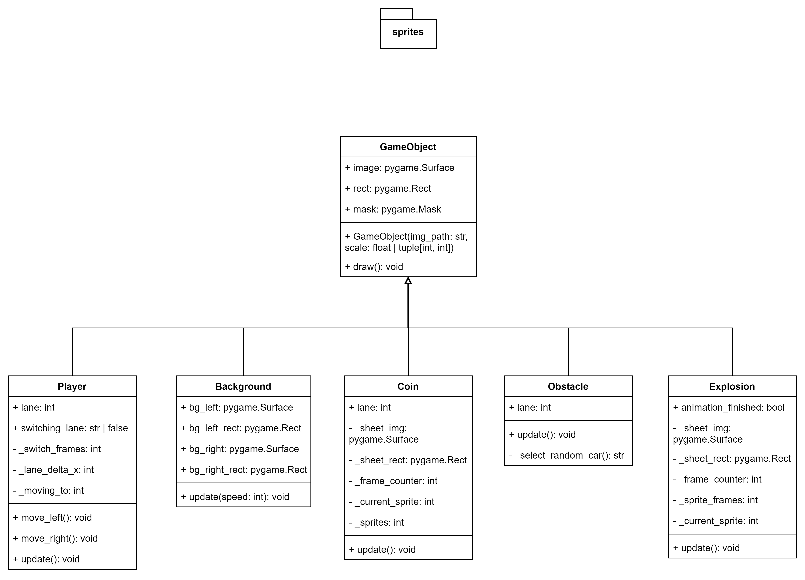
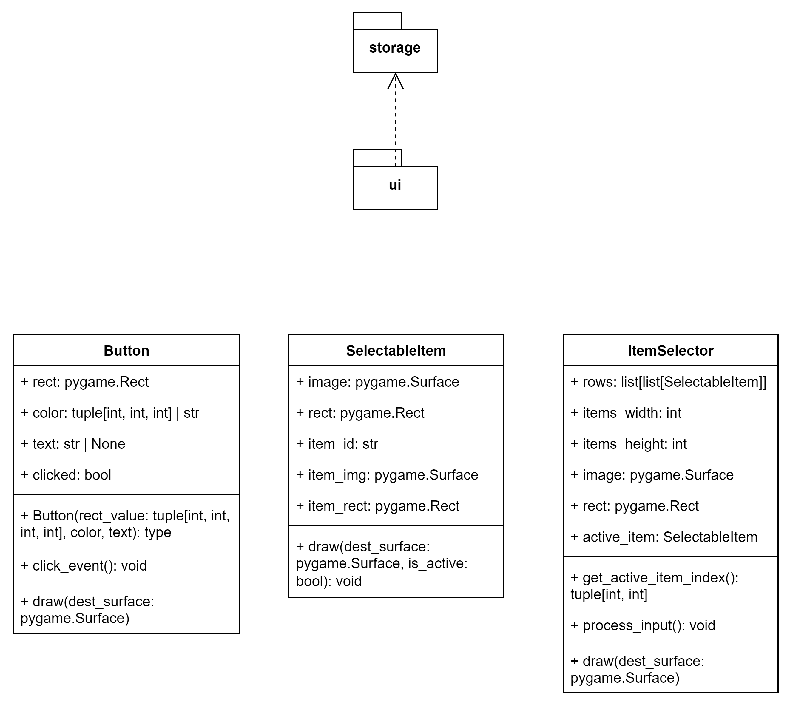
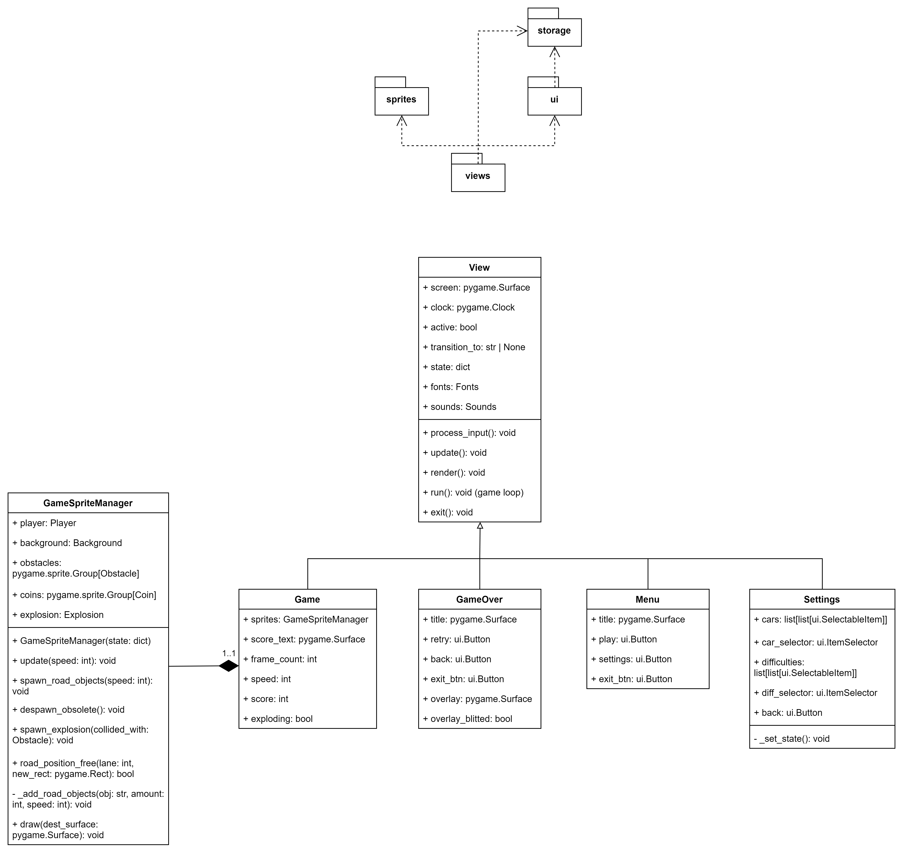
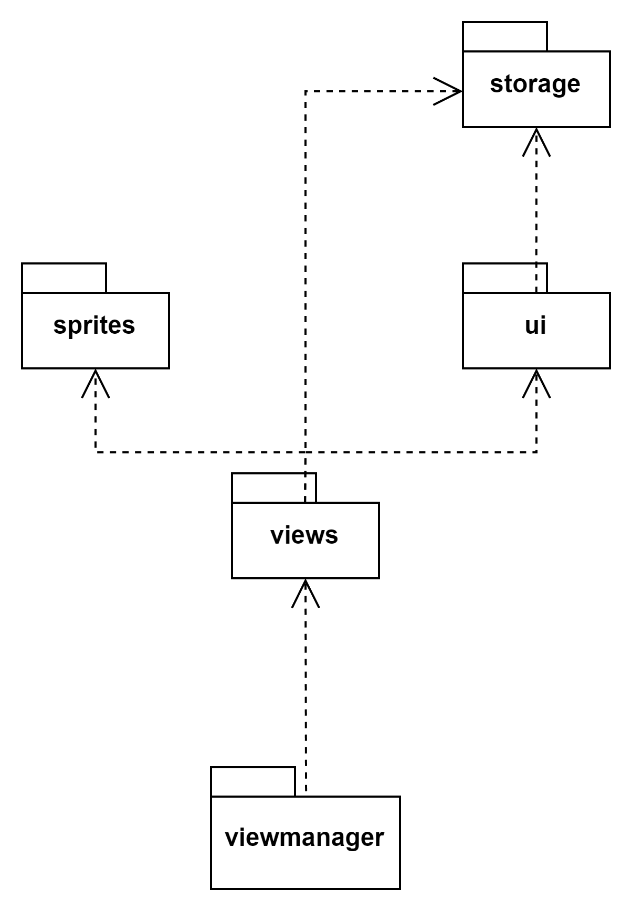

# TrafficEvader

A simple car game. Evade the traffic, collect coins and earn high scores!



To play the game, download the project, and start `main.py`:

```
python main.py
```

## About the project

The game was created using [pygame](https://www.pygame.org).

Below you'll find a collection of images, diagrams and similiar which sum up how the project is set up.

<details>

<summary>An early sketch of the project</summary>

<!--  -->


</details>

<details>

<summary>View module UML class diagrams</summary>

The diagrams are valid as of commit [14cd1c8](https://github.com/ZeroWave022/TrafficEvader/commit/14cd1c8a9cc09669c1f2a268f96ff02927b7d82c).

### `viewmanager` class diagram

<!--  -->


### `storage` class diagram

<!--  -->


### `sprites` class diagram

<!--  -->


### `ui` class diagram

<!--  -->


### `views` class diagram

<!--  -->


### A complete overview: UML package diagram

<!--  -->


</details>

## Assets used

A big thank you goes to the creators of the following game assets and tools:

- [Gem and coin sprites](https://laredgames.itch.io/gems-coins-free)
- [Explosion Animations Pack](https://ansimuz.itch.io/explosion-animations-pack)
- [16-bit Race Car Set](https://brad-gilbertson.itch.io/16bit-race-car-set)
- [NES Touring Car](https://chasersgaming.itch.io/racing-asset-touring-car-nes-psuedo) & [NES Police Car](https://chasersgaming.itch.io/racing-asset-police-car-nes)
- [Pixel Art City Cars](https://ipixl.itch.io/city-cars)
- [12x12 RPG Tileset](https://cypor.itch.io/12x12-rpg-tileset)
- [Classic Arcade Sound Effects](https://yourpalrob.itch.io/classic-arcade-sound-effects)
- [Menu Sounds Archive](https://moludar.itch.io/menu-sounds-archive)
- [Public Pixel Font](https://ggbot.itch.io/public-pixel-font)
- [PixelMe pixel art generator](https://pixel-me.tokyo/en/) used to create the obstacle sprites

## License

This project is licensed under the [Apache License 2.0](https://github.com/ZeroWave022/TrafficEvader/blob/main/LICENSE) (excluding any sprites, sounds, fonts or other assets which have their own licenses).
